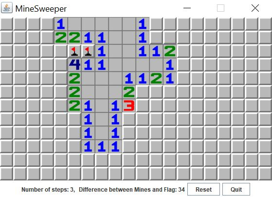
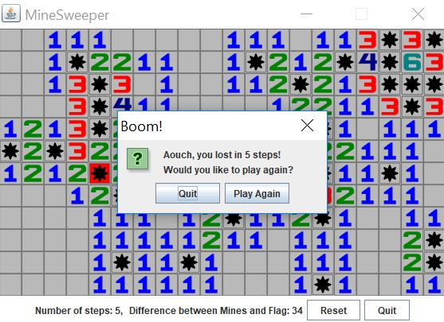

# MineSweeper

MineSweeper utilizes the **Model-View-Controller (MVC)** architectural pattern and **Stacks** data structure to create the famous [Minesweeper](https://en.wikipedia.org/wiki/Minesweeper_(video_game)) game. The game is created using multiple Java GUI Frameworks (see screenshots below).

<p align="center">
     
    
</p>


## Getting Started 

Clone the repository with:

```
git clone https://github.com/EricHaggar/MineSweeper.git
```

Change your directory to the project

```
cd MineSweeper
```

### Prerequisites

Make sure you have the Java SE Development Kit 8 or higher. If not install it from:

    https://www.oracle.com/technetwork/java/javase/downloads/jdk11-downloads-5066655.html


## Running the tests

Open a terminal within the directory and compile the all java files using:

```
javac *.java
```
Run the test 

```
java MineSweeper
```

## Built With

* [java.awt](https://docs.oracle.com/javase/7/docs/api/java/awt/package-summary.html)
* [javax.swing](https://docs.oracle.com/javase/7/docs/api/javax/swing/package-summary.html)

## More Information

Note: to generate the Java Documentation, enter the following on the command line:

```
 javadoc -d doc .java -private
```
